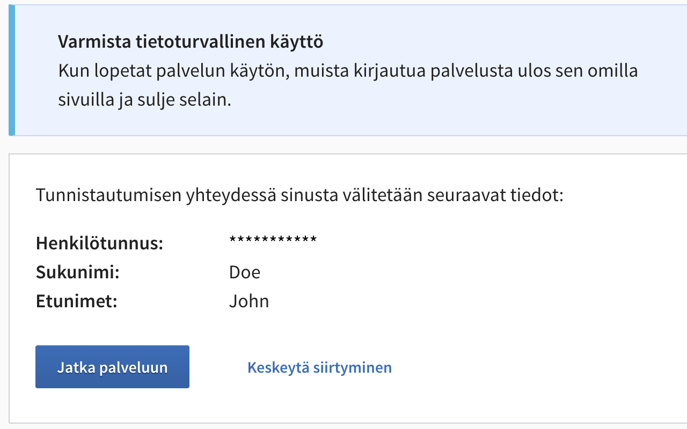

# hetu - Hide SSN on Finnish authentication sites

A minimal Chrome extension that uses pure CSS to hide visible Finnish personal identity code ("Henkilotunnus") values on selected authentication pages.

Download it on [the Chrome web store!](https://chromewebstore.google.com/detail/hetu-hide-ssn-on-finnish/ngphgkcnedlegecmlpeapemechaeojop)

## What it does

- Injects CSS only on configured login URLs.
- Hides the visible SSN value while keeping page layout intact.
- Uses no JavaScript and no external dependencies.

## Supported pages

- Suomi.fi login page
- Danske Bank authentication page
- S-pankki authentication page

## How it works

The extension ships one stylesheet (`hide.css`) via a Manifest V3 content script.

Current CSS selectors:

- `th#ssn-number + td`
- `th[data-i18n="attribute__hetu"] + td > strong`

Both selectors hide only the SSN value content using `visibility: hidden`.

## Install locally (unpacked)

1. Clone this repository.
2. Open Chrome and go to `chrome://extensions`.
3. Enable **Developer mode**.
4. Click **Load unpacked**.
5. Select this project folder.

## Verify behavior

1. Open one of the supported URLs.
2. Confirm the SSN text is hidden.
3. Confirm other page content still appears normally.

## Project structure

- `manifest.json` - Extension metadata and URL matching.
- `hide.css` - CSS rules that hide SSN values.
- `PRIVACY_POLICY.md` - Privacy statement for users and store listing.
- `docs/chrome-web-store-listing.md` - Ready-to-use listing text.
- `docs/release-checklist.md` - Release and publish checklist.

## Privacy and permissions

- No data collection.
- No tracking.
- No remote code.
- No network calls.
- The extension only runs on explicitly matched URLs.

See `PRIVACY_POLICY.md` for details.

## Open source

This project is licensed under MIT. See `LICENSE`.

## Contributing

Please read `CONTRIBUTING.md` before opening a PR.

## Automated release

Merges to `main` trigger a GitHub Actions workflow that packages `manifest.json`, `hide.css`, and `icons/`, uploads and publishes the new version to the Chrome Web Store, then creates a git tag and GitHub Release (`v<manifest-version>`).

Configure these repository secrets before using automation:

- `CHROME_EXTENSION_ID`
- `CHROME_WEB_STORE_CLIENT_ID`
- `CHROME_WEB_STORE_CLIENT_SECRET`
- `CHROME_WEB_STORE_REFRESH_TOKEN`

Important: Chrome Web Store uploads require the extension `version` in `manifest.json` to be higher than the currently published version.
